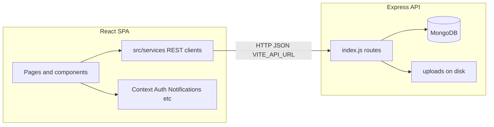

# CITBIF

Incubation-program platform: founders complete onboarding, manage documents and program activity; administrators review applications, approve startups, and maintain mentors, investors, and events.

---

## Table of contents

1. [Overview](#overview)  
2. [Key features](#key-features)  
   - [Profile setup](#profile-setup)  
   - [Startup (founder) experience](#startup-founder-experience)  
   - [Admin experience](#admin-experience)  
3. [Architecture](#architecture)  
4. [Tech stack](#tech-stack)  
5. [API and frontend services](#api-and-frontend-services)  
6. [Clone the repository](#clone-the-repository)  
7. [Backend setup](#backend-setup)  
8. [Frontend setup](#frontend-setup)  
9. [Run the application](#run-the-application)  
10. [Create accounts and typical flows](#create-accounts-and-typical-flows)  
11. [Project structure](#project-structure)  
12. [Environment variables](#environment-variables)  
13. [Scripts](#scripts)  
14. [Production deployment](#production-deployment)  
15. [License](#license)  
16. [Contributing](#contributing)  

---

## Overview

CITBIF is a **full-stack web application**: a **React + TypeScript** client talks to a **Node.js + Express** API backed by **MongoDB**. Users sign up as either **admins** or **founders (users)**. Founders go through a **profile wizard** that creates **Profile** and **Startup** records; admins **review** and **approve** or **reject** applications. After approval, founders use a **dashboard** (data room, mentors, investors, calendar, pitch deck, fundraising, settings).

**Data consistency:** Profile saves can **mirror** key fields onto the linked **Startup** document (name, founder, email, sector, program type) so admin lists stay aligned. **Startup stage** (idea → scale) is updated in **Settings** and stored on **Startup** for admin views. Some admin views **refresh on a timer** and when the **browser tab becomes visible** so recent founder changes appear without a full reload.

**Entry UX:** Visiting `/` shows a short **splash** (animated **CITBIF** wordmark), then navigates to **login**.

---

## Key features

### Profile setup

| Item | Description |
|------|-------------|
| **Multi-step wizard** | Personal info, enterprise details, incubation history, document uploads, pitch/traction, funding. |
| **Persistence** | Profile stored in MongoDB; wizard can create or update the **Startup** application record for admin review. |
| **Post-login requirement** | Founders without a linked startup are directed to complete the wizard before the main dashboard. |

### Startup (founder) experience

| Area | Description |
|------|-------------|
| **Overview** | Status, startup stage, and program context. |
| **Data room** | Upload and organize documents (API-backed). |
| **Mentors** | Browse mentors and request sessions. |
| **Investors** | Browse investors and request introductions. |
| **Calendar** | Program events. |
| **Pitch deck / Fundraising** | Workspace UI for decks and funding tracking. |
| **Settings** | Personal details, **current stage**, participation status where applicable. |

**Access:** If the startup is **pending** or **rejected**, the app shows an appropriate holding state instead of the full dashboard until the record is **approved** (or the user is guided back to login).

### Admin experience

| Area | Description |
|------|-------------|
| **Dashboard** | Metrics and startup tables; data can refresh periodically and on tab focus. |
| **Review** | Application queue; per-startup detail with summary, profile tabs, **startup stage**, approve/reject. |
| **Startup management** | Approved portfolio; detail modal with basics (including **current stage**) and full profile. |
| **Data room** | Browse startups and their documents. |
| **Mentors / investors / events** | Manage directory entries and program events. |
| **Notifications** | Admin and user notification feeds (read/unread, counts). |

---

## Architecture

High-level request flow:



- **Single codebase:** `server/` hosts the API; repo root hosts the Vite SPA.  
- **No server-side rendering:** the browser loads static assets; all business logic for persistence goes through `/api/*`.  
- **Files:** uploads use **Multer** under `server/uploads` (and/or paths returned in document/report records).

---

## Tech stack

### Frontend

| Technology | Role |
|------------|------|
| **React 18** | UI |
| **TypeScript** | Typing |
| **Vite** | Dev server and production bundle |
| **React Router** | Routing (`/`, `/login`, `/dashboard/*`, `/admin/*`, etc.) |
| **Tailwind CSS** | Styling |
| **Framer Motion** | Animations (e.g. splash, header) |
| **Lucide React** | Icons |

### Backend

| Technology | Role |
|------------|------|
| **Node.js** | Runtime |
| **Express** | HTTP API |
| **MongoDB + Mongoose** | Data layer |
| **Multer** | Multipart uploads |
| **bcryptjs** | Password hashing |
| **dotenv** | Environment loading |
| **cors** | Cross-origin for local dev |
| **nodemailer** | Available for transactional email (configure as needed) |

---

## API and frontend services

All JSON API routes are served under **`/api`** (see `server/index.js`). The SPA calls them using **`VITE_API_URL`** as the base (see `src/services/*.ts`).

### Route map (summary)

| Domain | HTTP | Paths (examples) |
|--------|------|-------------------|
| **Health** | GET | `/api/health` |
| **Auth** | POST | `/api/auth/signup`, `/api/auth/login` |
| **Profiles** | GET / POST / PUT | `/api/profiles/user/:userId`, `/api/profiles`, `/api/profiles/:id` |
| **Startups** | GET / POST / PUT / DELETE | `/api/startups`, `/api/startups/:id`, `/api/startups?userId=...` |
| **Startup lifecycle** | PUT / POST | `/api/startups/phase/:userId`, `/api/startups/:id/approve`, `/api/startups/:id/reject` |
| **Documents** | GET / POST / PUT / DELETE | `/api/documents`, `/api/documents/upload`, `/api/documents/user/:userId`, `/api/documents/startup/:startupId`, `/api/documents/:id`, `/api/documents/:id/download` |
| **Mentors** | CRUD + POST | `.../mentors`, `.../mentors/:id`, `.../mentors/request-session` |
| **Investors** | CRUD + POST | `.../investors`, `.../investors/:id`, `.../investors/request-intro` |
| **Events** | CRUD + GET | `.../events`, `.../events/upcoming`, `.../events/completed`, `.../events/categories` |
| **Reports** | CRUD + download | `.../reports`, `.../reports/:id/download/:fileIndex` |
| **Notifications** | GET / PUT / DELETE | `/api/notifications/user/...`, `/api/notifications/admin/...`, read and unread-count |

### Frontend service modules (`src/services/`)

| Module | Typical use |
|--------|-------------|
| `profileApi.ts` | Profile create/update/fetch by user |
| `startupsApi.ts` | Startups list, get, update, phase, approvals |
| `documentsApi.ts` | Upload and document CRUD |
| `mentorsApi.ts`, `eventsApi.ts`, `investorsApi.ts` | Directories and actions |
| `notificationsApi.ts` | User and admin notifications |
| `reportsApi.ts` | Reports where used |

Mock variants (`mock*.ts`) exist for optional local/demo paths; wire features to real APIs as needed.

---

## Clone the repository

```bash
git clone https://github.com/Keerthana-R786/startup.git
cd startup
```

---

## Backend setup

1. **Install dependencies**

   ```bash
   cd server
   npm install
   ```

2. **Configure environment**  
   Create **`server/.env`** (see [Environment variables](#environment-variables)).

3. **MongoDB**  
   Run MongoDB locally or provision **MongoDB Atlas** and set `MONGODB_URI`.

4. **Optional scripts** (from `server/`)

   - `npm run test-connection` — verify connectivity if configured in your repo.  
   - `npm run seed-admin` — seed admin user if your project includes this script.

---

## Frontend setup

1. From the **repository root** (parent of `server/`):

   ```bash
   npm install
   ```

2. Create **`.env`** in the **root** with the API base URL:

   ```env
   VITE_API_URL=http://localhost:5000
   ```

3. **Favicon / branding assets** live under `public/` (e.g. `favicon.png`).

---

## Run the application

1. Start **MongoDB**.  
2. Start the **API** (from `server/`):

   ```bash
   npm start
   ```

   For file-watch reload during development:

   ```bash
   npm run dev
   ```

   Default API: `http://localhost:5000` — verify with **GET** `/api/health`.

3. Start the **frontend** (from repo root):

   ```bash
   npm run dev
   ```

4. Open the URL Vite prints (commonly **`http://localhost:5173`**).  
   - **`/`** — splash, then redirect to login.  
   - **`/login`**, **`/signup`** — authentication.

---

## Create accounts and typical flows

### Admin

1. Open **Sign up**.  
2. Choose **Admin** (or equivalent role selector).  
3. Submit the form; after login, you are routed to **`/admin/dashboard`**.  
4. Use **Review** to approve or reject startup applications; use other admin sections for day-to-day management.

### Founder (user)

1. Open **Sign up** as **User**.  
2. Complete the **profile wizard** (creates/updates **Profile** and **Startup**).  
3. While status is **pending** (or **rejected**), the app shows the appropriate gate screen.  
4. After **approval**, sign in and use **`/dashboard`** and nested routes (data room, mentors, etc.).

---

## Project structure

```
startup/
├── public/                 # Static assets (favicon, etc.)
├── server/
│   ├── index.js            # Express app, Mongo models, routes, profile↔startup sync
│   ├── uploads/            # Uploaded files (Multer)
│   ├── package.json
│   ├── seed-admin.js       # Optional seeding
│   └── test-connection.js  # Optional DB test
├── src/
│   ├── components/
│   │   ├── auth/           # Login, Signup, SplashScreen
│   │   ├── dashboard/      # Startup + admin pages
│   │   ├── layout/         # Header, Sidebar, AnimatedBackground
│   │   ├── profile/        # Profile wizard steps
│   │   └── ui/             # Shared UI
│   ├── context/            # Auth, Applications, Notifications, Funding, Alerts
│   ├── hooks/              # useStartups, etc.
│   ├── services/           # API clients
│   ├── types/
│   ├── App.tsx
│   ├── main.tsx
│   └── index.css
├── index.html
├── package.json
├── vite.config.ts
├── tailwind.config.js
├── tsconfig.json
└── README.md
```

MongoDB creates collections as models are used, including (names approximate): **`users`**, **`admins`**, **`profiles`**, **`startups`**, **`documents`**, **`mentors`**, **`investors`**, **`events`**, **`reports`**, **`usernotifications`**, **`adminnotifications`**.

---

## Environment variables

### `server/.env`

| Variable | Required | Description |
|----------|----------|-------------|
| `PORT` | Optional | HTTP port for Express (e.g. `5000`). |
| `MONGODB_URI` | Yes | MongoDB connection string (local or Atlas). |

Example:

```env
PORT=5000
MONGODB_URI=mongodb://localhost:27017/citbif
```

### Root `.env` (Vite)

| Variable | Required | Description |
|----------|----------|-------------|
| `VITE_API_URL` | Yes for API calls | Base URL of the backend (no trailing slash), e.g. `http://localhost:5000`. |

**Security:** Never commit real `.env` files with secrets. Use `.env.example` in teams if you introduce one; keep production secrets in your host’s secret store.

---

## Scripts

| Location | Command | Purpose |
|----------|---------|---------|
| Root | `npm run dev` | Start Vite dev server |
| Root | `npm run build` | Production build → `dist/` |
| Root | `npm run preview` | Preview production build locally |
| Root | `npm run lint` | ESLint |
| `server/` | `npm start` | Run API (`node index.js`) |
| `server/` | `npm run dev` | API with `node --watch` reload |

---

## Production deployment

- Set **`VITE_API_URL`** at **build time** to your public API URL, then **`npm run build`** and serve **`dist/`** over HTTPS.  
- Run the API with **`NODE_ENV=production`**, a strong **`MONGODB_URI`**, and restricted **CORS** origins.  
- Harden file upload limits, validate inputs, and protect admin capabilities (the app uses role-based UX; enforce authorization on the server for sensitive operations in production).

---

## License

This project is licensed under the **ISC License** (see `server/package.json` and repository metadata).

---

## Contributing

1. Fork the repository.  
2. Create a feature branch (`git checkout -b feature/your-change`).  
3. Commit with clear messages.  
4. Open a pull request describing behavior, setup steps, and any API or schema changes.
